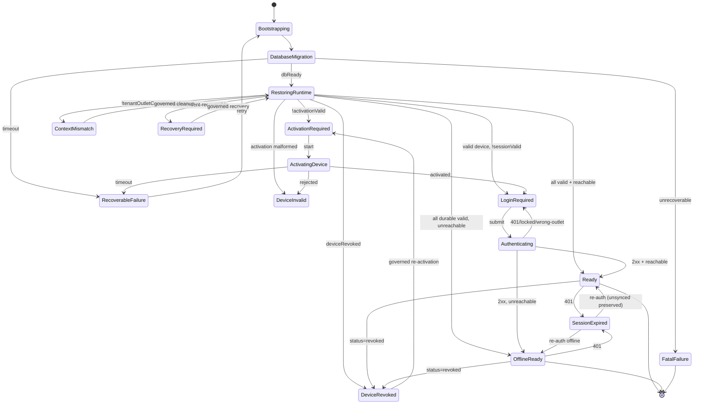

# UIX-8C-07 — Deterministic Startup / Auth State Machine

The Android cashier boot path (`com.aishtech.poslite`) is rebuilt as a single
**deterministic, bounded startup/auth state machine**. Where UIX-8C-06 bound the
receipt to one logical transaction, UIX-8C-07 binds every launch to exactly one
resolved `BootState`, evaluated by a pure function from immutable inputs. There is
no boolean-soup of `isLoading` / `isLoggedIn` / `hasDevice` flags racing across
`Activity`s: the state holder owns one enum, the evaluator is total, and the UI
renders it.

This foundation implements **UIX8C-R211..R216** (deterministic startup/auth state
machine; bounded startup; no login-flash when restorable; connectivity ≠
reachability). It extends — never weakens — rules 55/56/57/58/59 and
UIX8C-R001..R210.

## Layering

```
AishPosApplication ──► BootActivity ──► BootViewModel ──► StartupCoordinator (pure)
                                              │                     ▲
                                              │                     │ StartupInputs
                                              ├──► RuntimeContextLoader (Room + SecureTokenStore)
                                              ├──► DeviceStatusRepository (GET /android/device/status)
                                              └──► SessionValidator      (token presence + auth/me)
                                                            │
                                                            ▼
                                                       BootState (sealed)
```

`StartupCoordinator.evaluate(inputs: StartupInputs): BootState` is a **pure**
function in `core/startup/StartupCoordinator.kt` — no Android, no coroutines, no
I/O. All effectful gathering lives in `BootViewModel`; the coordinator only maps a
fully-materialised `StartupInputs` snapshot to a single `BootState`. This makes the
entire decision table unit-testable on the JVM (`StartupCoordinatorTest`) with hand
inputs.

## `StartupInputs`

`core/startup/StartupInputs.kt` — an immutable snapshot the ViewModel assembles once
per evaluation pass. Every field is a resolved fact, never a request-supplied value.

| Field | Type | Meaning |
|-------|------|---------|
| `dbReady` | `Boolean` | Room open + migrations applied on the current tenant partition |
| `restoredContext` | `RuntimeContext?` | A durable runtime context rebuilt from storage, or null |
| `activationValid` | `Boolean` | A device activation record exists and is structurally valid |
| `deviceRevoked` | `Boolean` | Server-authoritative revoked flag (last known, from `device/status`) |
| `deviceStatusKnown` | `Boolean` | Whether a server device-status has ever been resolved this install |
| `sessionValid` | `Boolean` | A non-expired cashier token is present and server-confirmed (or last-good offline) |
| `tenantOutletConsistent` | `Boolean` | Restored tenant/outlet match the activation + session identity |
| `pendingUnsyncedCount` | `Int` | Count of non-acked local transactions (incl. `OFFLINE_PENDING`) |
| `online` | `Boolean` | Transport connectivity signal only — **not** a reachability guarantee |

`online` is a connectivity hint (`ACCESS_NETWORK_STATE`). Server reachability is
proven only by a real authenticated round trip (`auth/me`, `device/status`);
`sessionValid` and `deviceStatusKnown` carry that proof. A device that is connected
but cannot reach the backend is treated as offline-authoritative, never as
"online + healthy" (**UIX8C-R216**, connectivity ≠ reachability).

## States (`core/startup/BootState.kt`)

`sealed interface BootState`. Each object/class is a terminal or transient node the
UI can render truthfully; none is a colour-only signal.

| State | Kind | Meaning / UI |
|-------|------|--------------|
| `Bootstrapping` | transient | Process just started; inputs not yet gathered. Splash + indeterminate progress. |
| `DatabaseMigration` | transient | Room open / migration in flight on the tenant partition. "Menyiapkan data…" |
| `RestoringRuntime` | transient | Rebuilding `RuntimeContext` from secure storage + Room. No login flash. |
| `ActivationRequired` | terminal-step | No valid activation record; route to device activation. |
| `ActivatingDevice` | transient | `POST /android/device/activate` in flight. |
| `LoginRequired` | terminal-step | Device valid, no valid cashier session; route to login. |
| `Authenticating` | transient | `POST /auth/login` in flight. |
| `Ready` | terminal | All preconditions valid **and** server-confirmed; enter cashier home online. |
| `OfflineReady` | terminal | All durable preconditions valid; server unreachable; enter cashier home offline-authoritative. |
| `SessionExpired` | terminal-step | Token rejected (401) or expired; preserve unsynced work, route to re-auth. |
| `DeviceInvalid` | terminal-step | Activation record structurally invalid / unknown to server; re-activation required. |
| `DeviceRevoked` | terminal (locked) | Server says revoked; fail-closed lock, no cashier access, pending queue quarantined. |
| `ContextMismatch` | terminal (locked) | Restored tenant/outlet inconsistent with activation/session; refuse to enter. |
| `RecoveryRequired` | terminal-step | Durable state is inconsistent but recoverable via a governed cleanup/re-activation. |
| `RecoverableFailure(cause)` | transient-fail | A bounded, retryable startup failure (timeout, transient I/O). Offers Retry. |
| `FatalFailure(cause)` | terminal-fail | Unrecoverable startup failure (corrupt partition beyond repair). Actionable message. |

`SessionExpired`, `DeviceInvalid`, `DeviceRevoked`, `ContextMismatch`, and
`RecoveryRequired` are all reached **without** discarding unsynced transactions
(**UIX8C-R229..R234**); the durable queue is preserved and, for revocation,
quarantined rather than deleted.

## The `Ready` precondition (UIX8C-R211/R213)

`Ready` is emitted **only** when every one of these is simultaneously true:

1. Installation is present (app-generated installation id resolved).
2. Device activation is valid (`activationValid`).
3. Device is **not** revoked (`!deviceRevoked`, with `deviceStatusKnown` when online).
4. Tenant is resolved and consistent.
5. Outlet is resolved and consistent (`tenantOutletConsistent`).
6. Cashier session is valid (`sessionValid`).
7. Cashier authorization is confirmed for this tenant/outlet.
8. The local data partition matches the resolved tenant (no cross-tenant reuse).

If server reachability cannot be proven this session but every **durable**
precondition (1,2,4,5,6,7,8 from last-good state, and no server-known revocation)
holds, the coordinator emits `OfflineReady` instead of `Ready` — truthfully offline,
never a fabricated "online" (**UIX8C-R216/R242**). Any single failed precondition
short-circuits to the corresponding step/locked state; a fail-closed default routes
unknown/ambiguous combinations to `RecoveryRequired`, never to `Ready`
(**UIX8C-R226**, tenant-isolation fail-closed).

## No login-flash when restorable (UIX8C-R214)

While `restoredContext` is being rebuilt the coordinator holds `RestoringRuntime`
(splash), never `LoginRequired`. A returning cashier with a valid durable session
transitions `Bootstrapping → DatabaseMigration → RestoringRuntime → Ready/OfflineReady`
and **never** sees a login screen flash. `LoginRequired` is emitted only after
restoration has completed and genuinely found no valid session — a resolved fact,
not a mid-restore intermediate.

## Bounded startup / timeout (UIX8C-R212)

Every transient state (`DatabaseMigration`, `RestoringRuntime`, `ActivatingDevice`,
`Authenticating`) runs under a bounded deadline in `BootViewModel` (a
`withTimeout`-guarded gather). A deadline breach does not hang on the splash: it
resolves to `RecoverableFailure(TIMEOUT)` with a Retry affordance (or, when a
durable offline context exists, to `OfflineReady`). Network calls carry their own
OkHttp timeouts; the startup budget is the ceiling above them. No unbounded spinner,
no indefinite "Menyiapkan…".

## Transition table

| From | Condition | To |
|------|-----------|-----|
| `Bootstrapping` | process start | `DatabaseMigration` |
| `DatabaseMigration` | `dbReady` | `RestoringRuntime` |
| `DatabaseMigration` | migration error (unrecoverable) | `FatalFailure` |
| `DatabaseMigration` | timeout | `RecoverableFailure(TIMEOUT)` |
| `RestoringRuntime` | `!activationValid` | `ActivationRequired` |
| `RestoringRuntime` | activation malformed / unknown | `DeviceInvalid` |
| `RestoringRuntime` | `deviceRevoked` | `DeviceRevoked` |
| `RestoringRuntime` | `restoredContext != null && !tenantOutletConsistent` | `ContextMismatch` |
| `RestoringRuntime` | activation valid, `!sessionValid` | `LoginRequired` |
| `RestoringRuntime` | all durable preconditions valid, `online` + server-confirmed | `Ready` |
| `RestoringRuntime` | all durable preconditions valid, server unreachable | `OfflineReady` |
| `RestoringRuntime` | inconsistent-but-recoverable | `RecoveryRequired` |
| `ActivationRequired` | user starts activation | `ActivatingDevice` |
| `ActivatingDevice` | `activate` 2xx, status active | `LoginRequired` |
| `ActivatingDevice` | `activate` rejected (used / wrong-tenant / invalid) | `DeviceInvalid` |
| `ActivatingDevice` | transport timeout | `RecoverableFailure(TIMEOUT)` |
| `LoginRequired` | user submits credentials | `Authenticating` |
| `Authenticating` | `login` 2xx | re-evaluate → `Ready` / `OfflineReady` |
| `Authenticating` | `login` 401 / locked / wrong-outlet | `LoginRequired` (typed error) |
| `Ready` / `OfflineReady` | 401 from any authed call | `SessionExpired` |
| `Ready` / `OfflineReady` | `device/status` → revoked | `DeviceRevoked` |
| `SessionExpired` | re-auth success, unsynced preserved | `Ready` / `OfflineReady` |
| `DeviceRevoked` | (locked) governed re-activation only | `ActivationRequired` |
| `ContextMismatch` | governed cleanup + re-scope | `RestoringRuntime` |
| `RecoveryRequired` | governed cleanup / re-activation | `RestoringRuntime` |
| `RecoverableFailure` | user retry | `Bootstrapping` |

Revocation and context-mismatch are **fail-closed locks**: the only exit is a
governed re-activation or cleanup, never a back-press, deep link, restart, or going
offline (**UIX8C-R219**, revoked no-bypass).

## Mermaid diagram



## Reuse (no second path)

The coordinator consumes the existing `RuntimeContext`, `OfflineSaleRepository`
(pending count + quarantine), `OfflineSyncStatus`, the stable `clientReference`, and
`SecureTokenStore`; it introduces no second checkout, offline, sync, or backend-sale
pipeline. `pendingUnsyncedCount` is read from the same durable Room source the
history reconciler uses, so the logout gate (UIX8C-R229..R234) and the boot machine
agree on exactly what "unsynced" means.
